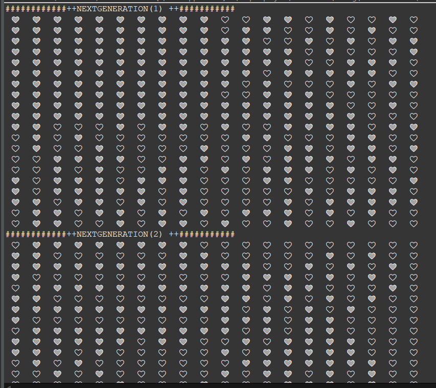

# GameOfLife
Das Spiel wurde nur zum Üben der an der Uni erworbenen C++ Kenntnisse.
Das Game of Life, auch einfach Life genannt, ist ein zellulärer Automat, der 1970 von dem britischen Mathematiker John Horton Conway entwickelt wurde.  
[Mehr darüber?](https://en.wikipedia.org/wiki/Glider_(Conway%27s_Game_of_Life))  

## Beschreibung

Eine Zelle hat 2 Zstände:
 - ❤️: sie ist lebendig
 - 🤍: sie ist tod
Ob eine Zelle lebendig//tod wird oder bleiben sollte bestimmen die Regeln, die in der Funktion `nextState()` implementiert sind.

Außerdem gibt es die Funktionen:
- `nextGeneration()`: diese wird mittels `nextState()` den nächsten Zustand alle Zellen bestimmen.
- `futurGeneration(n)`: zeigt anhand von `nextGeneration()` die Weiterentwicklung von `n` Generationen von Zellen.

## Zur Ausführung 

Dafür sollen Sie den Projekt klonen und lokal die Datei `.cpp` ausführen  
Bei einer Terminal Ausführung( also mit der `.exe-`Datei) bitte ändern sie die Zustandwerte in der Funktion `futurGeneration(n)`. ZB: 1 und 0 nutzen.  

## Konsole Demo

